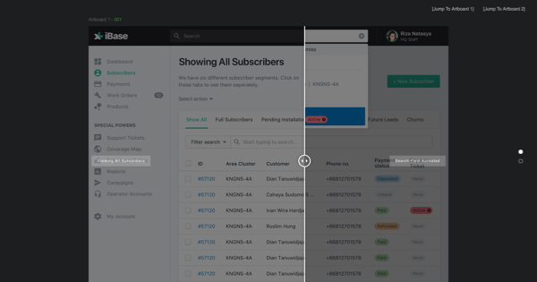

# InterPare 🅰️️

InterPare - Compare Interface Design (ALPHA). It's based on zurb's twentytwenty plugin.

It is a tool I use to-  
* show stakeholders the difference between two UI design screenshots.  
* do design QA testing after developer iterations.  

## Demo

https://musavvirahmed.github.io/InterPare-BETA/

## License

MIT
